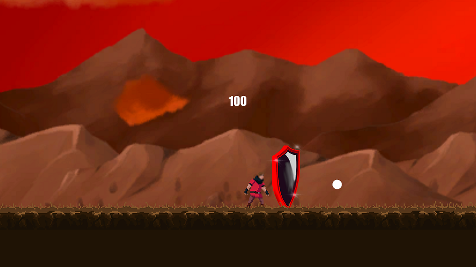
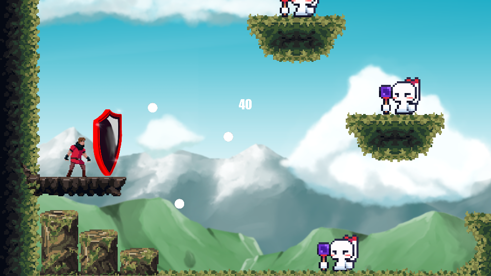
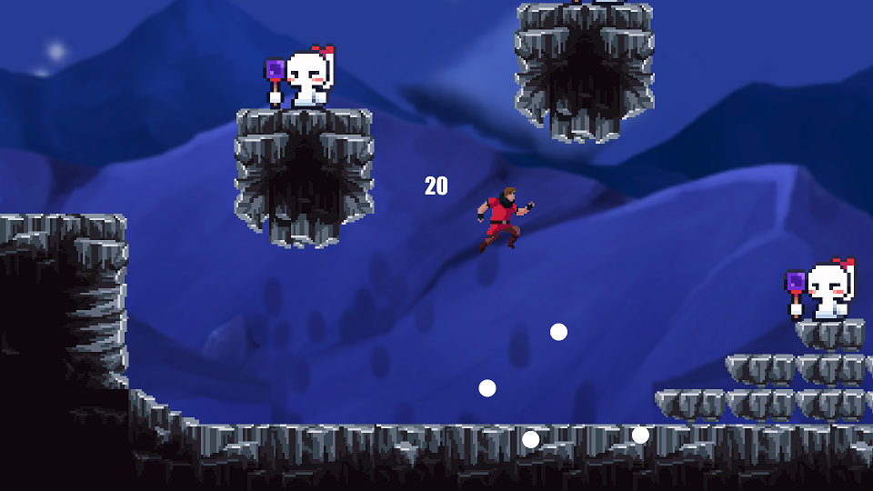

# _Press Kit_
## Counter Attacker

Welcome to our game! Our game is a 2D platform game that is inspired by classic games such as _Contra_ and _Super Mario Bros_. While brainstorming, we had the idea to implement the Block/Reflect design from the _Dark Souls_ series and the _Sekiro:Shadows Die Twice_. We then combined these elements to form our own game.

### Game Facts

- Developers: Grace Sun, Ricardo Sun, Kin Hei Wong, Yizhen Liu, Dylan Long
- Release Date: June 9, 2021 (Windows, OSX)
- Platforms: PC
- Price: Free!
- Availability: By request
- Languages: English
- ESRB Rating: E for everyone - Contains mild violence
- File Size: 233 mb
- Contact: dalong@ucdavis.edu
- Instruction Manual: **TODO!**

### Screenshots

### Logo
