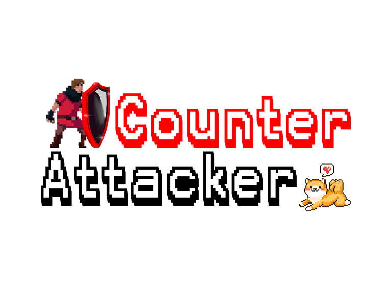

# _Press Kit_
## Counter Attacker

Welcome to our game! Our game is a 2D platform game that is inspired by classic games such as _Contra_ and _Super Mario Bros_. While brainstorming, we had the idea to implement the Block/Reflect design from the _Dark Souls_ series and the _Sekiro:Shadows Die Twice_. We then combined these elements to form our own unique game. In Counter Attacker, you will fight through levels of enemies armed with projectile launchers, but you will only have a shield to defend yourself! Luckily, your shield wielding ability is well-honed, and your shield is large and strong -- but not impervious! You shield will break if you do not time its use just right. Reflect the enemies projectiles back at them to defeat them and progress through the levels. Beat all three levels to save your dog!

### Game Facts

- Developer Team: Puppy Savior
- Developers: Grace Sun, Ricardo Sun, Kin Hei Wong, Yizhen Liu, Dylan Long
- Release Date: June 9, 2021 (Windows, OSX)
- Platforms: PC
- Price: Free!
- Availability: By request
- Languages: English
- ESRB Rating: E for everyone - Contains mild violence
- File Size: 233 mb
- Contact: dalong@ucdavis.edu
- Instruction Manual: **TODO!**

### Game Style

Get ready to be teleported back in time! As novice developers, we began with a simple, yet engaging, 2D platformer game. As the game developed, we found ourselves inspired by the nostalgia of the game feel. We were reminded of 90's gaming classics such as _Contra_ and _Super Mario Bros_. So, we decided to lean into this effect, and embrace the 80's/90's game style. From the movement, to the music, the game is designed to bring you back to the classic gaming experience from the dawn of gaming culture.

### History

Our team was founded at UC Davis in a game development course. We had many ideas of the games we wanted to develop, and, although several sounded enticing, we decided Counter Attacker would be the perfect first game for our development team. Through the development of this game we have gotten to know one another and have supported each other as we grow as game developers.

### Logo

  

### Screenshots

### Trailer

https://youtu.be/MCESlzAYfKo
